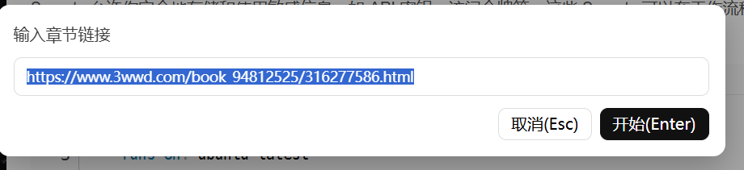

# 小窗净读器（极简/强容错/多页拼合）

> 当前脚本版本：**v0.5.2**（极简，无标题、无按钮，仅 300×400 白色浮窗）

## 目录

- [功能特性](#功能特性)
- [快速开始](#快速开始)
- [脚本头部（关键权限）](#脚本头部关键权限)
- [键盘操作](#键盘操作)
- [抓取与解析逻辑](#抓取与解析逻辑)
- [已知站点说明](#已知站点说明)
- [隐私与使用边界](#隐私与使用边界)
- [版本变更](#版本变更)
- [维护与反馈](#维护与反馈)

---
##
效果图



---
## 功能特性

- **一键连读**：贴入任意章节链接，自动抓取本章的多分页（_2.html、_3.html…）并拼合为干净正文。
- **键盘优先**：
  - ↑/↓：小窗内平滑滚动（到顶/底自动翻页或跳章）
  - ←/→：优先翻“上一页/下一页”；无分页时跳“上一章/下一章”
  - Alt+L：弹出输入链接的自定义弹窗
  - Ctrl+Alt+X：显示/隐藏浮窗
  - Alt+R 返回上一次阅读
  - Alt+T 打开目录
- **强兼容**：
  - GM_xmlhttpRequest 跨域抓取（含 GBK/GB2312），30s 超时保护
  - 自动识别并解码字符集
  - 站点热键不干扰（事件监听于捕获阶段）
- **净化处理**：移除脚本/广告/推荐板块等噪点，图片与链接自动绝对化。
- **专门适配**：已适配 3wwd.com（#content 正文容器，#prev_url/#next_url 导航；多页一章 _2.html…）。

---

## 快速开始

1. 安装脚本管理器（任选其一）：
   - Chrome/Edge：Tampermonkey
   - Firefox：Tampermonkey 或 Violentmonkey
2. 创建新脚本，将项目脚本全文粘贴进去保存（脚本头部示例见下）。
3. 打开任意网页，按 `Alt+L` 呼出输入弹窗，粘贴章节 URL（例如：https://www.3wwd.com/book_94812525/316277543.html），回车开始阅读。
4. 使用方向键在小窗内连读；`Ctrl+Alt+X` 可随时隐藏或再次显示小窗。

---

## 脚本头部（关键权限）

```javascript
// ==UserScript==
// @name         小窗净读器（极简/强容错/多页拼合）
// @namespace    https://jx.local/clean-reader
// @version      0.4.1
// @description  Alt+L 输入链接→抽正文；←/→ 翻页/跳章；↑/↓ 平滑滚动；Ctrl+Alt+X 显示/隐藏；捕获阶段接管方向键；跨域抓取含 GBK；极简无标题无按钮。
// @match        *://*/*
// @grant        GM_xmlhttpRequest
// @grant        GM_addStyle
// @connect      *
// @connect      3wwd.com
// @connect      m.3wwd.com
// @run-at       document-idle
// ==/UserScript==
```

说明：

- `@match *://*/*` 让脚本全站生效，真正抓取目标由你手动输入 URL 决定。
- `@connect *` 便于跨域抓取；若想更收敛，可改为仅保留常用域名。
- 必需权限：`GM_xmlhttpRequest`、`GM_addStyle`。

---

## 键盘操作

| 快捷键         | 作用                                 |
| -------------- | ------------------------------------ |
| Alt + L        | 打开自定义输入弹窗（贴入章节链接）   |
| Alt + T        | 打开自定义目录弹窗   |
| Alt + R        | 返回上一次阅读   |
| Ctrl + Alt + X | 显示/隐藏小窗                        |
| ↑ / ↓          | 小窗内平滑滚动；顶/底触发翻页/跳章   |
| ← / →          | 优先分页翻页；无分页跳章             |

> 只有当小窗可见且输入弹窗未打开时，脚本才会接管方向键。

---

## 抓取与解析逻辑

- **多页识别**：正则 (\d+)(?:_(\d+))?.html$，同基 ID视为同章
- **导航策略**：
  - #prev_url / #next_url
  - 文本匹配「上一章 / 下一章 / 上一页 / 下一页」
- **净化策略**：
  - script style ins .adsbygoogle .ad .advert [id^="hm_t_"] .recommend .toolbar 等噪声一键清除
- **超时保护**：单页 30 s；每章上限 50 页，防死循环
- **字符集识别**：响应头 → <meta charset> → 回退 UTF-8

---

## 已知站点说明

| 域名             | 正文容器 | 上一/下一页         | 分页模式     |
| ---------------- | -------- | ------------------- | ------------ |
| 3wwd.com / m.3wwd.com | #content | #prev_url / #next_url | _2.html 形式 |

---

## 隐私与使用边界

- 本脚本仅在用户本地浏览器中运行，不会主动收集或上传用户数据。
- 由于站点结构或反爬虫策略变化，可能导致脚本失效或抓取错误，请自行核对。
- 本脚本不能用于违法行为
- 使用本脚本即表示您已了解并接受以上条款。

---

## 版本变更

| 版本   | 亮点                     |
| ------ | ------------------------ |
| v0.5.3 | 添加记忆功能基于localstroge实现 |
| v0.5.2 | 添加目录功能，修改行距，可以更改位置以及大小 |
| v0.4.1 | 修复非法选择器；强化容错；极简 UI |
| v0.4.0 | 30 s 超时 & 死循环保护  |
| v0.3.0 | 全站生效 + 自定义弹窗   |

---

## 备注
从软件到说明全由gpt完成！！！
